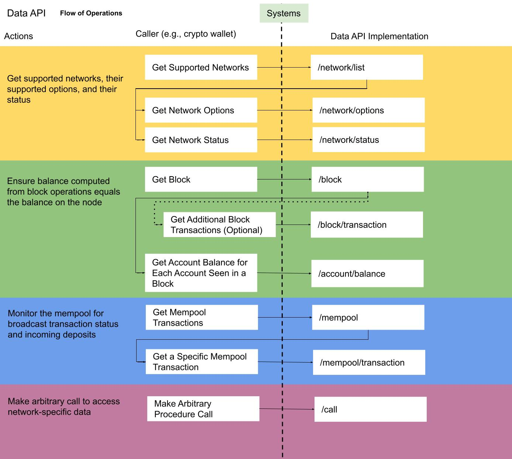
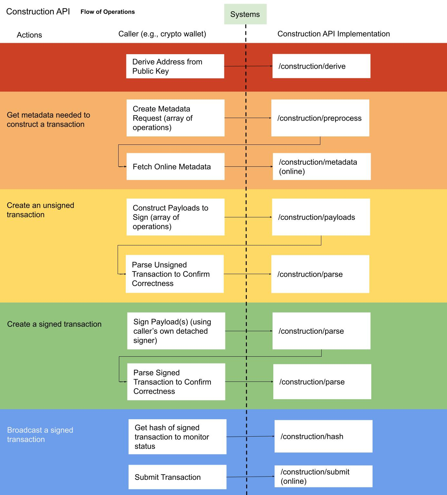
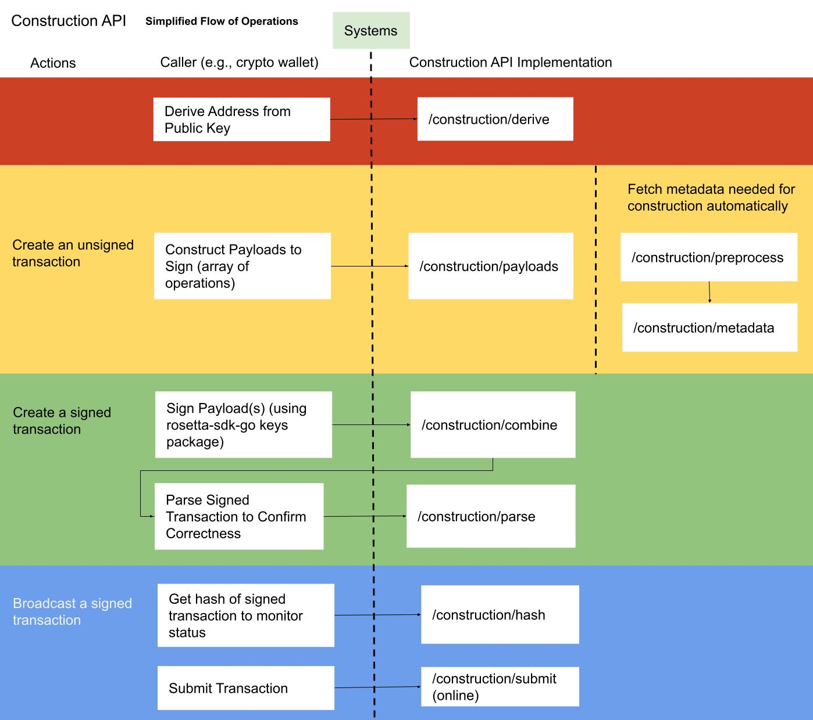
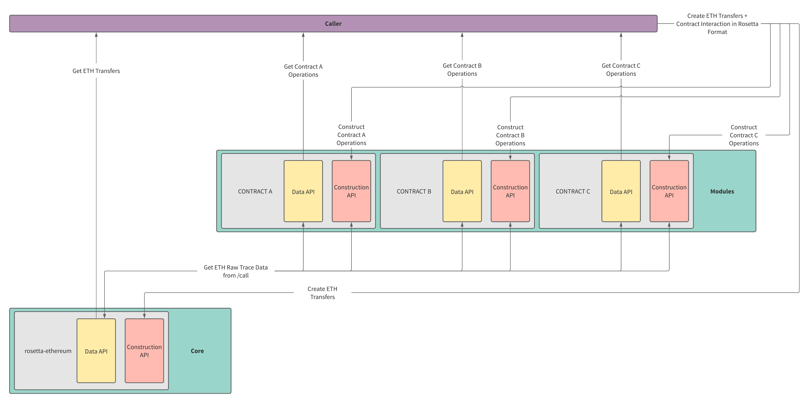

  

<h3 align="center">
   Rosetta Specifications
</h3>

This repository contains all specification files used to generate code for the Rosetta API.

  
  

## Overview
The Rosetta API is specified in the [OpenAPI 3.0 format](https://www.openapis.org)
(the [successor to Swagger/OpenAPI 2.0](https://swagger.io/blog/news/whats-new-in-openapi-3-0)).
Requests and responses can be crafted with auto-generated code using
[Swagger Codegen](https://swagger.io/tools/swagger-codegen) or
[OpenAPI Generator](https://openapi-generator.tech), are human-readable
(easy to debug and understand), and can be used in servers and browsers.

## Flow of Operations
Before diving into the specification and documentation, we recommend reviewing
the high-level diagrams below to gain some familiarity with the functionality
of the Rosetta APIs.

The Rosetta APIs are organized into two distinct categories, the Data API and
the Construction API. Simply put, the Data API is for retrieving data from
a blockchain network and the Construction API is for constructing and
submitting transactions to a blockchain network.

_The Data API was previously known as the Node API and the Construction API
was previously known as the Wallet API. Their names were changed to better
reflect their functionality._

### Data API

### Construction API
If you have seen illustrations of the flow of transaction
construction in other blockchain SDKs, the following diagrams
may seem peculiar to you. Unlike traditional SDKs, Construction API
implementations are fully stateless, can perform construction
offline (when metadata like an account nonce is pre-fetched),
and never have access to private key material.

#### Simplified Flow using a Higher-Level Interface
Many developers may not have security constraints that dictate construction must
occur offline or that they use their own detached signer (making the previously
described flow much more cumbersome than other transaction construction and
signing SDKs).

Fortunately, it is possible (and encouraged) to build higher-level interfaces
on top of these low-level endpoints to simplify development for integrators.
For example, an interface developer may wish to automatically fetch metadata
during their call to construct a transaction so users would not even
know there are multiple interactions occurring. One could also provide
a signing library with their higher-level interface so users do not need
to use a detached signer. Here is an example of a simplified flow:

Why go through all this trouble to build a higher-level interface on this
Construction API instead of just using existing SDKs, you may be wondering?
Any interface built on top of the Construction API could support the construction
of transactions on any blockchain that supports Rosetta with no modification.
You could, for example, build a [WalletLink](https://www.walletlink.org/) service
that worked with any blockchain.

## Modules
For blockchains with smart contracts, it is usually not possible to add high fidelity
support for each deployed contract to the "core" Rosetta implementation. Accessing any
contract often requires generating some SDK and making very contract-specific access
decisions that can introduce significant complexity into the "core" implementation.

So, no smart contract interaction in Rosetta? Think again!

To empower developers to build Rosetta API implementations for a given smart contract
on top of your "core" implementation, we recommend implementing the `/call` endpoint
and providing support for common network-specific endpoints that would be used to
read or modify contract state. In theory, you could stack any number of Rosetta API
implementations on top of each other where each child implementation calls some
set of primitives exposed in this `/call` endpoint.

In the case of Ethereum, a group of developers could implement a core
`rosetta-ethereum` implementation that provides the ability to track
and create ETH transfers and another group of developers could write a
`rosetta-erc20` that allows for tracking and creating ERC-20 token transfers
using the `eth_call` method exposed by `rosetta-ethereum`. Another group of
developers could write an implementation that tracks DEX trades, lending activity,
or even validator performance. You can see an example of how this would work in
this illustration:

## Indexers
For some developers, the existing Data API and Construction API endpoints are not
sufficient to fully support an asset integration. It is not possible, for example,
to search for a transaction by hash or access all transactions that affected
a particular account. Traditionally database-intensive functionality was purposely
excluded from the collection of endpoints any Rosetta implementation must complete
as to avoid imposing cumbersome requirements on Rosetta implementers (that could require
maintaining architecture alongside their core node).

Because of the standardization introduced by Rosetta, it is possible
to write a generic indexer for any Rosetta implementation.
To avoid a proliferation of interfaces that service Rosetta in this layer,
we've defined a set of standard "indexer" endpoints that enable developers
to automatically integrate (with the SDK they already use to access the
Rosetta API). **Rosetta implementations are not required to implement "indexer" endpoints
but are welcome to do so!**

Indexer implementations must proxy non-indexer Data API and
Construction API calls to the implementation of interest (potentially
caching some data) so that developers do not need to connect to multiple
endpoints to access Rosetta. All calls contain a `NetworkIdentifier` so it
should be possible to route requests without too much difficulty.

### Required Endpoints
* Data API (proxied)
* Construction API (proxied)
* `/events/*`
* `/search/*`

_If you think an endpoint is missing from this list, please reach out
on our [community](https://community.rosetta-api.org/)._

## Documentation
Now that you have some familiarity with the flow of operations, we recommend taking a look at the Rosetta API Docs:

* [Overview](https://www.rosetta-api.org/docs/welcome.html)
* [Data API](https://www.rosetta-api.org/docs/data_api_introduction.html)
* [Construction API](https://www.rosetta-api.org/docs/construction_api_introduction.html)

If you have any questions, don't hesitate to reach out in our [community forum](https://community.rosetta-api.org).

## Writing a Rosetta API Implementation
If you've made it this far, you are interested in developing a Rosetta API implementation
for a blockchain project you are working on. As mentioned in the Rosetta doumentation, there
is [no restriction on what language you choose to use for your implementation](https://www.rosetta-api.org/docs/no_gatekeepers.html#no-required-languages)
and [no repository](https://www.rosetta-api.org/docs/no_gatekeepers.html#no-master-repository)
where you must open a PR to share your work.

When you've finished an implementation for a blockchain, share your work in the
[ecosystem category of the community site](https://community.rosetta-api.org/c/ecosystem).
Platforms looking for implementations for certain blockchains will be monitoring
this section of the website for high-quality implementations they can use
for integration (make sure your implementation meets the
["expectations" of any implementation](https://www.rosetta-api.org/docs/node_deployment.html)).

### Reference Implementations
For many developers, the best way to get started is to look at an example. For this reason,
we developed a complete Rosetta API reference implementation for [Bitcoin](https://github.com/coinbase/rosetta-bitcoin)
and [Ethereum](https://github.com/coinbase/rosetta-ethereum).

_Developers of Bitcoin-like or Ethereum-like blockchains may find it easier to fork these reference implementations than to write an implementation from scratch._

### Pick a Language
#### Using Golang
If you are comfortable with Golang, the easiest way to write a Rosetta Data API implementation
is to use [rosetta-sdk-go](https://github.com/coinbase/rosetta-sdk-go). This Golang project
provides a [server package](https://github.com/coinbase/rosetta-sdk-go/tree/master/server) that
empowers a developer to write a full Rosetta Data API server by only implementing an interface.
This package automatically validates client requests and calls the functions you implement
with pre-parsed requests (instead of in raw JSON).

There is a simple [example](https://github.com/coinbase/rosetta-sdk-go/tree/master/examples/server) of
how to write an implementation using this package in [rosetta-sdk-go](https://github.com/coinbase/rosetta-sdk-go).

#### Using Another Language
If you plan to use a language other than Golang, you will need to either codegen
a server (the [overview](#overview) mentions some tools that can help with this) or
write one from scratch. If you do choose to write an implementation in another language,
we ask that you create a separate repository in an SDK-like format for all the code you generate
so that other developers can use it (see the note on [SDKs in more languages](#sdks-in-more-languages)). Check out
[rosetta-sdk-go](https://github.com/coinbase/rosetta-sdk-go) for an example of how to generate
code from this specification.

### CurveTypes and SignatureTypes
The Construction API only supports detached, curve-based key generation and signing.
In short, this means that Construction API implementations will never have
access to private keys and will only ever interact with public keys and signatures
in standardized formats. These formats are listed below:

_CurveType and SignatureType are purposely decoupled as a curve could be used
with multiple signature types (i.e. `secp256k1:ECDSA` and `secp256k1:Schnorr`)._

#### Supported CurveTypes
* secp256k1: SEC compressed - `33 bytes` (https://secg.org/sec1-v2.pdf#subsubsection.2.3.3)
* secp256r1: SEC compressed - `33 bytes` (https://secg.org/sec1-v2.pdf#subsubsection.2.3.3)
* edwards25519: `y (255-bits) || x-sign-bit (1-bit)` - `32 bytes` (https://ed25519.cr.yp.to/ed25519-20110926.pdf)
* tweedle: 1st pk : Fq.t (32 bytes) || 2nd pk : Fq.t (32 bytes) (https://github.com/CodaProtocol/coda/blob/develop/rfcs/0038-rosetta-construction-api.md#marshal-keys)

#### Supported SignatureTypes
* ecdsa: `r (32-bytes) || s (32-bytes)` - `64 bytes`
* ecdsa_recovery: `r (32-bytes) || s (32-bytes) || v (1-byte)` - `65 bytes`
* ed25519: `R (32-byte) || s (32-bytes)` - `64 bytes`
* schnorr_1: `r (32-bytes) || s (32-bytes)` - `64 bytes`
* schnorr_poseidon: `r (32-bytes) || s (32-bytes) where s = Hash(1st pk || 2nd pk || r)` - `64 bytes`

`schnorr_1` is a EC-Schnorr signature implemented by Zilliqa where both `r` and `s` are scalars encoded as `32-bytes` values, most significant byte first. Refer to [Zilliqa's Schnorr Library](https://github.com/Zilliqa/schnorr/blob/master/src/libSchnorr/src/Schnorr.cpp#L86) and [Zilliqa Technical Whitepaper - Appendix A: Schnorr Digital Signature](https://docs.zilliqa.com/whitepaper.pdf) for details.)

`schnorr_poseidon` is an EC-schnorr signature with Poseidon hash function implemented by O(1) Labs where both `r` and `s` are scalars encoded as `32-bytes` little-endian values. Refer to [Coda's signer reference implementation](https://github.com/CodaProtocol/signer-reference/blob/master/schnorr.ml#L92)

#### Adding New CurveTypes or SignatureTypes
Unlike the Data API where there are no global type constraints (ex: you
can specify any operation type), the Construction API has a clearly
enumerated list of supported curves and signatures. Each one of these
items has a clearly specified format that all implementations should
expect to receive.

If a curve or signature you are employing is not enumerated in the specification,
you will need to open a PR against the specification to add it along with the standard
format it will be represented in.

It is up to the caller of a Construction API implementation to implement key generation
and signing for a particular CurveType:SignatureType. There is a `keys` package
in rosetta-sdk-go that is commonly used by callers and anyone
in the community can implement additional schemes there.

### Deployment
Although the Construction API is defined in the same interface as endpoints that
are "online" (i.e. fetching a block with `/block`), it must be possible to deploy your Data API
and Construction API separately. This does not mean implementations need to live
in separate repositories or even be defined in separate Dockerfiles. However, it must be possible
to start an "offline-only" version of your implementation that supports all Construction API
endpoints (other than `/construction/metadata` and `/construction/submit`).

#### Online Mode Endpoints
* `/network/*`
* `/block/*`
* `/account/*`
* `/mempool/*`
* `/call`
* `/construction/metadata`
* `/construction/submit`

#### Offline Mode Endpoints
* `/network/list`
* `/network/options`
* `/construction/derive`
* `/construction/preprocess`
* `/construction/payloads`
* `/construction/combine`
* `/construction/parse`
* `/construction/hash`

### Validating Your Implementation
To validate your implementation, you'll need to run the [rosetta-cli](https://github.com/coinbase/rosetta-cli).
The `rosetta-cli` has a collection of "check" commands that are used to ensure your implementation adheres to the
Rosetta API. `check:data` ensures your implementation meets Data API requirements
and `check:construction` ensures your implementation meets Construction API requirements.

You can view an extensive list of checks this tool performs [here](https://github.com/coinbase/rosetta-cli#correctness-checks).
If you'd like to add more checks for correctness, feel free to [create an issue](https://github.com/coinbase/rosetta-cli/issues) listing
in detail what you think should be checked in any implementation.

## Writing an Integration
Before starting your own integration, we recommend reading this
[blog post](https://community.rosetta-api.org/t/introducing-rosetta-ethereum-coinbases-ethereum-implementation-of-the-rosetta-api) that
walks through how to fetch blocks from a Ethereum Rosetta API implementation.

The most developed tools for working with Rosetta API implementations can
be found in [rosetta-sdk-go](https://github.com/coinbase/rosetta-sdk-go). Below,
we highlight 2 packages in this repository that are very useful for parsing
data from a blockchain. You can find code examples of these packages throughout
the [rosetta-cli](https://github.com/coinbase/rosetta-cli), which uses `rosetta-sdk-go`
for all block processing.

### Syncer
The core of any integration is syncing blocks reliably. The [syncer](https://github.com/coinbase/rosetta-sdk-go/tree/master/syncer)
serially processes blocks from a Data API implementation (automatically handling re-orgs) with
user-defined handling logic and pluggable storage. After a block is processed, store it to a DB or send a push
notification...it's up to you!

### Parser
When reading the operations in a block, it can be helpful to apply higher-level
groupings to related operations or match operations in a transaction to some
set of generic descriptions (i.e. ensure there are 2 operations of equal but
opposite amounts). The [parser](https://github.com/coinbase/rosetta-sdk-go/tree/master/parser)
empowers any integrator to build abstractions on top of the
[low-level building blocks](https://www.rosetta-api.org/docs/low_level_ops.html)
that the Rosetta API exposes.

## SDKs in More Languages
At Coinbase, we write a lot of our code in Golang. We knew we could build a great SDK in Golang
so we put all of our effort into developing the [rosetta-sdk-go](https://github.com/coinbase/rosetta-sdk-go).

We look forward to working with the community to develop just as powerful of an SDK in both
Rust and JavaScript/TypeScript. If you'd like to work on SDKs in either of these languages,
let us know on the [community forum](https://community.rosetta-api.org). We may feature
a few of completed SDKs on the [website](https://www.rosetta-api.org) or on this README.

## Specification Development
* `make deps` to install dependencies
* `make gen` to generate the specification files
* `make check-valid` to ensure specification is valid
* `make release` to check if code passes all tests run by CircleCI

## License
This project is available open source under the terms of the [Apache 2.0 License](https://opensource.org/licenses/Apache-2.0).

© 2021 Coinbase